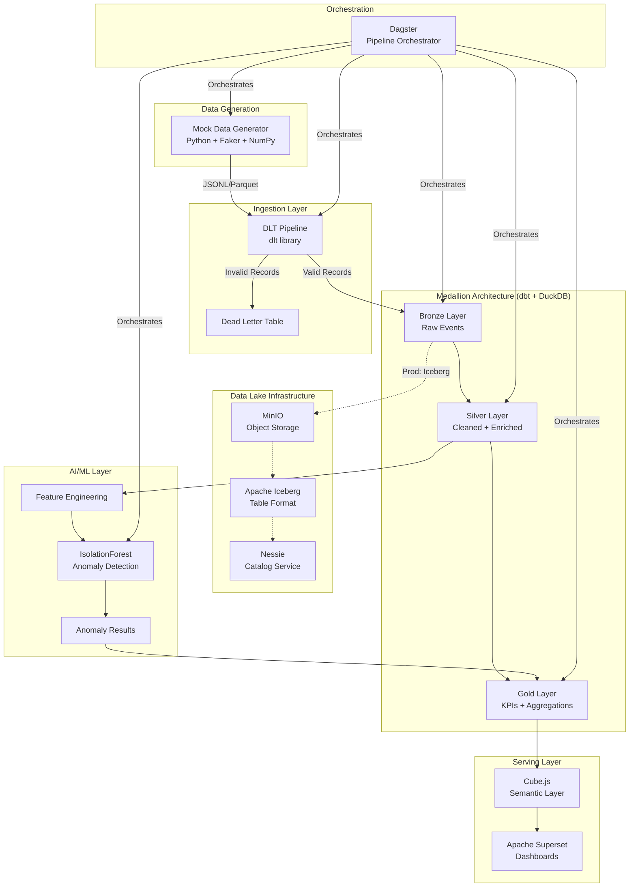
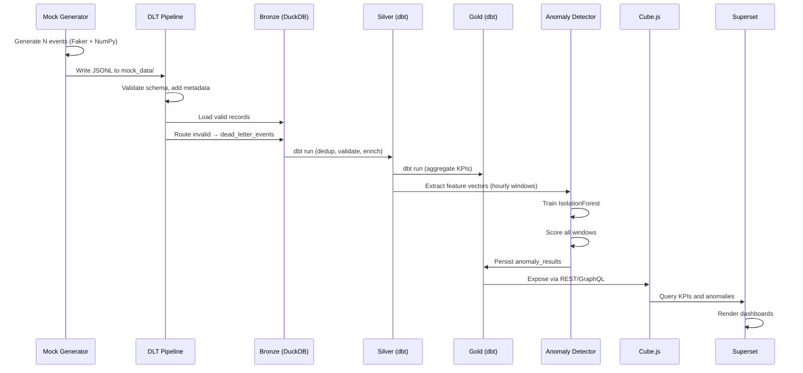
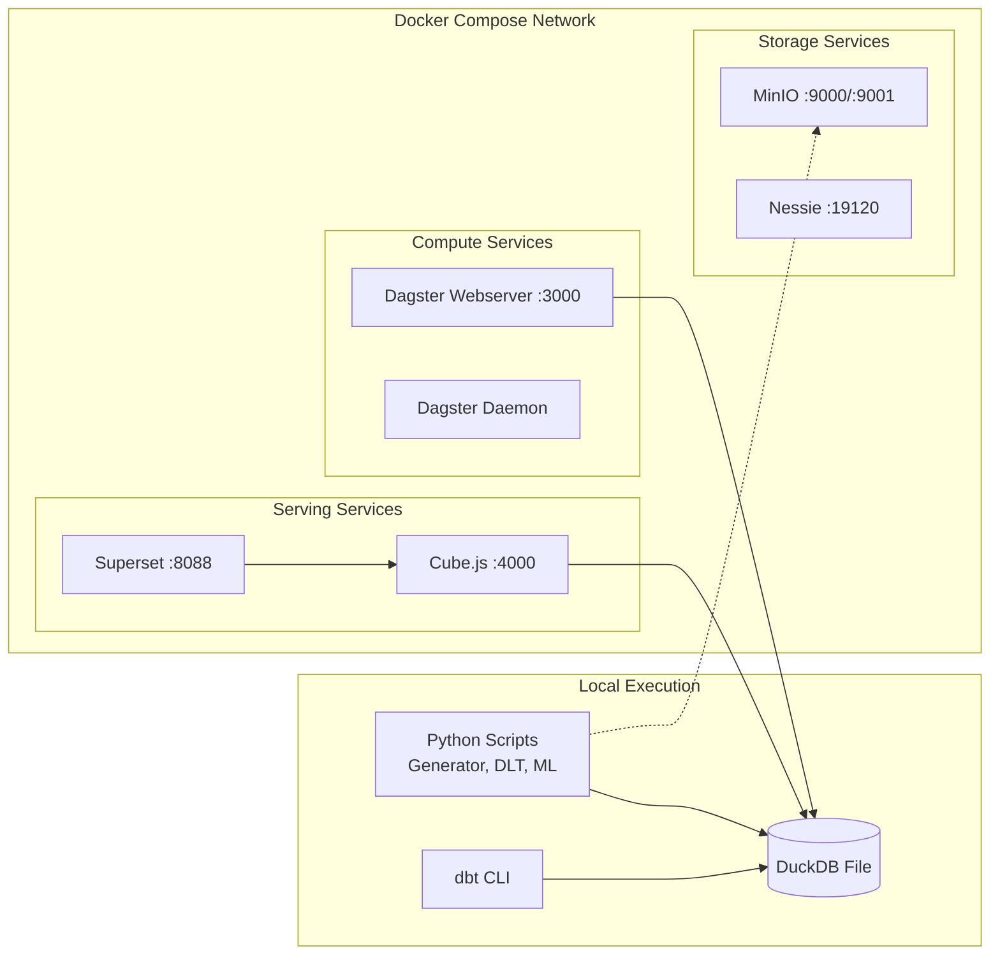
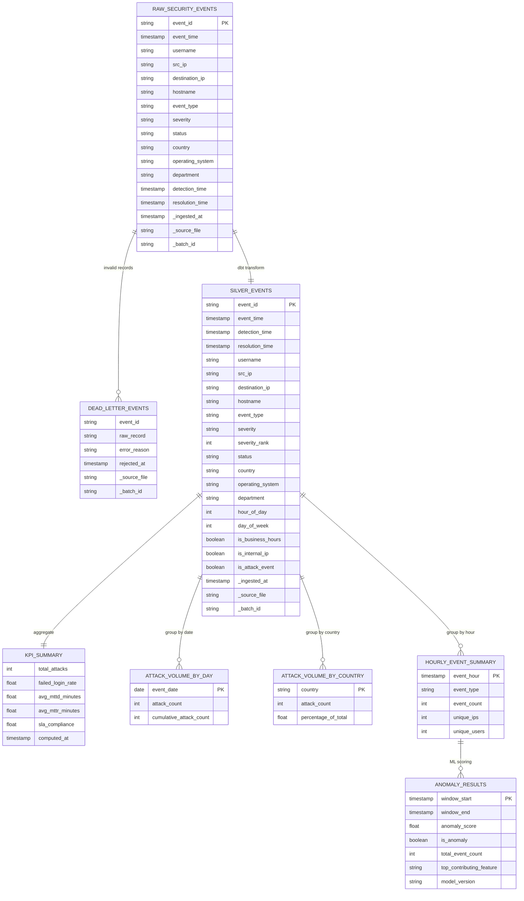
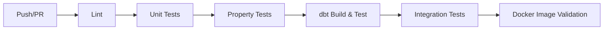

# Technical Design Document — AI-Powered Security Incident Analytics Platform

## Overview

This document defines the technical design for the AI-Powered Security Incident Analytics Platform. The platform demonstrates modern data engineering practices by ingesting synthetic security logs through a medallion architecture, computing security KPIs, exposing analytics via a semantic layer, visualizing dashboards, orchestrating pipelines, and detecting anomalies using machine learning.

### Design Goals

- **Modularity**: Each component is independently deployable, testable, and replaceable
- **Reproducibility**: Deterministic data generation and containerized infrastructure ensure consistent results
- **Progressive Complexity**: MVP (Phase 1) validates core data flow; Production (Phase 2) layers infrastructure
- **Portfolio Quality**: Production-grade patterns with comprehensive documentation and testing

### Technology Stack

| Layer | Technology | Version | Purpose |
|-------|-----------|---------|---------|
| Data Generation | Python + Faker + NumPy | 3.11+ / 22.0+ / 1.26+ | Synthetic security log creation |
| Ingestion | dlt (data load tool) | 0.4+ | Bronze layer loading with schema inference |
| Storage (MVP) | DuckDB + Parquet | 0.10+ | Analytical query engine and file format |
| Storage (Prod) | MinIO + Apache Iceberg + Nessie | latest / 1.4+ / 0.77+ | Object storage, table format, catalog |
| Transformation | dbt Core + dbt-duckdb | 1.7+ / 1.7+ | Medallion architecture transformations |
| Semantic Layer | Cube.js | 0.35+ | REST/GraphQL API exposure |
| Visualization | Apache Superset | 3.1+ | Interactive dashboards |
| Orchestration | Dagster | 1.6+ | Pipeline scheduling and asset management |
| ML/AI | scikit-learn (IsolationForest) | 1.4+ | Unsupervised anomaly detection |
| Containerization | Docker Compose | v2+ | Service orchestration |
| Observability | Python logging (JSON) | stdlib | Structured logging and health checks |


## Architecture

### System Architecture Diagram




### Data Flow Sequence



### Deployment Architecture




## Components and Interfaces

### Component 1: Mock Data Generator (`mock_data/`)

**Responsibility**: Generate realistic synthetic security log events with configurable volume, temporal patterns, and injected anomalies.

**Module Structure**:
```
mock_data/
├── __init__.py
├── generator.py          # Main generation orchestrator
├── schemas.py            # Pydantic models for Security_Event
├── distributions.py      # Statistical distribution configs
├── anomaly_injector.py   # Anomaly pattern injection
└── config.yaml           # Default configuration
```

**Key Interfaces**:

```python
# mock_data/generator.py
from dataclasses import dataclass
from pathlib import Path

@dataclass
class GeneratorConfig:
    count: int = 10_000
    seed: int | None = None
    time_range_days: int = 30
    output_dir: Path = Path("mock_data")
    output_formats: list[str] = field(default_factory=lambda: ["jsonl", "parquet"])
    severity_weights: dict[str, float] = field(default_factory=lambda: {
        "low": 0.40, "medium": 0.30, "high": 0.20, "critical": 0.10
    })
    event_type_weights: dict[str, float] = field(default_factory=dict)
    business_hour_ratio: float = 0.70
    internal_ip_ratio: float = 0.60
    anomaly_config: AnomalyConfig = field(default_factory=AnomalyConfig)

@dataclass
class AnomalyConfig:
    burst_count: int = 50
    burst_window_minutes: int = 5
    burst_windows: int = 4
    off_hours_escalation_count: int = 15
    geographic_anomaly_countries: list[str] = field(
        default_factory=lambda: ["KP", "IR", "SY"]
    )

def generate_security_events(config: GeneratorConfig) -> list[dict]:
    """Generate security events according to configuration.
    
    Returns list of event dictionaries conforming to Security_Event schema.
    Deterministic when config.seed is set.
    """
    ...

def write_events(events: list[dict], config: GeneratorConfig) -> dict[str, Path]:
    """Write events to configured output formats.
    
    Returns mapping of format name to output file path.
    """
    ...
```

```python
# mock_data/schemas.py
from pydantic import BaseModel, Field
from datetime import datetime
from enum import Enum

class EventType(str, Enum):
    FAILED_LOGIN = "failed_login"
    SUCCESSFUL_LOGIN = "successful_login"
    MALWARE_ALERT = "malware_alert"
    PRIVILEGE_ESCALATION = "privilege_escalation"
    SUSPICIOUS_IP = "suspicious_ip_activity"
    VPN_LOGIN = "vpn_login"
    ACCOUNT_LOCKOUT = "account_lockout"
    BRUTE_FORCE = "brute_force_attempt"

class Severity(str, Enum):
    LOW = "low"
    MEDIUM = "medium"
    HIGH = "high"
    CRITICAL = "critical"

class SecurityEvent(BaseModel):
    event_id: str = Field(..., description="UUID v4")
    event_time: datetime
    username: str
    src_ip: str
    destination_ip: str | None = None
    hostname: str
    event_type: EventType
    severity: Severity
    status: str
    country: str
    operating_system: str
    department: str
    detection_time: datetime | None = None
    resolution_time: datetime | None = None
```


### Component 2: DLT Ingestion Pipeline (`dlt_pipeline/`)

**Responsibility**: Load raw security events from JSONL files into the Bronze layer with metadata enrichment, dead letter routing, and idempotent operation.

**Module Structure**:
```
dlt_pipeline/
├── __init__.py
├── pipeline.py           # Pipeline definition and execution
├── sources.py            # dlt source and resource definitions
├── validators.py         # Record validation logic
└── config.yaml           # Pipeline configuration
```

**Key Interfaces**:

```python
# dlt_pipeline/sources.py
import dlt
from pathlib import Path

@dlt.source
def security_logs_source(data_dir: Path = Path("mock_data")):
    """dlt source that reads JSONL files from the data directory."""
    yield security_events_resource(data_dir)

@dlt.resource(write_disposition="merge", primary_key="event_id")
def security_events_resource(data_dir: Path):
    """dlt resource yielding validated security events with metadata.
    
    Adds _ingested_at, _source_file, _batch_id to each record.
    Routes invalid records to dead_letter_events table.
    """
    ...

# dlt_pipeline/pipeline.py
from dataclasses import dataclass

@dataclass
class IngestionResult:
    records_ingested: int
    records_rejected: int
    elapsed_seconds: float
    records_per_second: float
    batch_id: str

def run_ingestion(
    source_dir: Path = Path("mock_data"),
    destination: str = "duckdb",
    database_path: Path = Path("data/security_analytics.duckdb"),
) -> IngestionResult:
    """Execute the DLT ingestion pipeline.
    
    Supports incremental loading via dlt state management.
    Idempotent: re-running with same data produces no duplicates.
    """
    ...

# dlt_pipeline/validators.py
def validate_record(record: dict) -> tuple[bool, list[str]]:
    """Validate a security event record.
    
    Returns (is_valid, list_of_error_messages).
    Required fields: event_id, event_time, event_type.
    """
    ...
```

### Component 3: dbt Transformation Layer (`dbt_project/`)

**Responsibility**: Implement medallion architecture transformations from Bronze through Silver to Gold, including data quality tests and documentation.

**Module Structure**:
```
dbt_project/
├── dbt_project.yml
├── profiles.yml
├── packages.yml
├── models/
│   ├── staging/
│   │   ├── _staging_models.yml
│   │   └── stg_security_events.sql
│   ├── silver/
│   │   ├── _silver_models.yml
│   │   └── silver_events.sql
│   └── gold/
│       ├── _gold_models.yml
│       ├── kpi_summary.sql
│       ├── attack_volume_by_day.sql
│       ├── attack_volume_by_country.sql
│       └── hourly_event_summary.sql
├── macros/
│   ├── validate_ipv4.sql
│   ├── severity_rank.sql
│   └── is_rfc1918.sql
├── seeds/
│   └── event_type_mapping.csv
└── tests/
    └── assert_kpi_ranges.sql
```

**Key SQL Models**:

```sql
-- models/silver/silver_events.sql
{{
    config(
        materialized='incremental',
        unique_key='event_id'
    )
}}

WITH deduplicated AS (
    SELECT *,
        ROW_NUMBER() OVER (
            PARTITION BY event_id 
            ORDER BY _ingested_at DESC
        ) AS row_num
    FROM {{ source('bronze', 'raw_security_events') }}
    
    WHERE _ingested_at > (SELECT MAX(_ingested_at) FROM {{ this }})
    
),

validated AS (
    SELECT * FROM deduplicated
    WHERE row_num = 1
      AND TRY_CAST(event_time AS TIMESTAMP) IS NOT NULL
      AND {{ validate_ipv4('src_ip') }}
      AND severity IN ('low', 'medium', 'high', 'critical')
)

SELECT
    event_id,
    CAST(event_time AS TIMESTAMP) AS event_time,
    detection_time,
    resolution_time,
    LOWER(username) AS username,
    src_ip,
    destination_ip,
    UPPER(hostname) AS hostname,
    event_type,
    LOWER(severity) AS severity,
    {{ severity_rank('severity') }} AS severity_rank,
    status,
    country,
    operating_system,
    department,
    EXTRACT(HOUR FROM event_time) AS hour_of_day,
    EXTRACT(ISODOW FROM event_time) AS day_of_week,
    CASE WHEN EXTRACT(HOUR FROM event_time) BETWEEN 9 AND 16 
         THEN TRUE ELSE FALSE END AS is_business_hours,
    {{ is_rfc1918('src_ip') }} AS is_internal_ip,
    CASE WHEN event_type IN (
        'malware_alert','privilege_escalation',
        'suspicious_ip_activity','brute_force_attempt'
    ) THEN TRUE ELSE FALSE END AS is_attack_event,
    _ingested_at,
    _source_file,
    _batch_id
FROM validated
```

```sql
-- models/gold/kpi_summary.sql
{{
    config(materialized='table')
}}

SELECT
    COUNT(*) FILTER (WHERE is_attack_event) AS total_attacks,
    
    CAST(COUNT(*) FILTER (WHERE event_type = 'failed_login') AS FLOAT) /
    NULLIF(COUNT(*) FILTER (WHERE event_type IN ('failed_login', 'successful_login')), 0)
        AS failed_login_rate,
    
    AVG(EXTRACT(EPOCH FROM (detection_time - event_time)) / 60.0)
    FILTER (WHERE detection_time IS NOT NULL)
        AS avg_mttd_minutes,
    
    AVG(EXTRACT(EPOCH FROM (resolution_time - detection_time)) / 60.0)
    FILTER (WHERE resolution_time IS NOT NULL)
        AS avg_mttr_minutes,
    
    CAST(COUNT(*) FILTER (
        WHERE resolution_time IS NOT NULL 
        AND EXTRACT(EPOCH FROM (resolution_time - detection_time)) / 60.0 <= 240
    ) AS FLOAT) /
    NULLIF(COUNT(*) FILTER (WHERE resolution_time IS NOT NULL), 0)
        AS sla_compliance,
    
    CURRENT_TIMESTAMP AS computed_at

FROM {{ ref('silver_events') }}
```


### Component 4: AI Anomaly Detection (`ml_detection/`)

**Responsibility**: Extract feature vectors from hourly event summaries, train IsolationForest model, score time windows, and persist anomaly results.

**Module Structure**:
```
ml_detection/
├── __init__.py
├── features.py           # Feature vector extraction
├── train.py              # Model training
├── predict.py            # Model inference
├── evaluate.py           # Model evaluation metrics
└── config.yaml           # ML configuration
```

**Key Interfaces**:

```python
# ml_detection/features.py
import pandas as pd
from pathlib import Path

FEATURE_COLUMNS = [
    "total_event_count",
    "unique_src_ips",
    "unique_users",
    "failed_login_count",
    "failed_login_ratio",
    "attack_event_count",
    "avg_severity_rank",
    "critical_event_count",
    "unique_countries",
    "events_outside_business_hours_ratio",
]

def extract_features(db_path: Path) -> pd.DataFrame:
    """Extract feature vectors from hourly_event_summary table.
    
    Returns DataFrame with FEATURE_COLUMNS plus window_start, window_end.
    Each row represents one hourly time window.
    """
    ...

def validate_features(features_df: pd.DataFrame) -> bool:
    """Validate feature DataFrame has expected columns and no NaN values."""
    ...

# ml_detection/train.py
from sklearn.ensemble import IsolationForest
from dataclasses import dataclass
from pathlib import Path
import joblib

@dataclass
class TrainingConfig:
    n_estimators: int = 100
    contamination: float = 0.05
    random_state: int = 42
    model_dir: Path = Path("models")

@dataclass
class TrainingResult:
    model_path: Path
    model_version: str
    n_samples_trained: int
    n_anomalies_detected: int
    anomaly_percentage: float
    training_duration_seconds: float
    contamination_parameter: float
    n_estimators: int

def train_model(
    features_df: pd.DataFrame,
    config: TrainingConfig = TrainingConfig(),
) -> TrainingResult:
    """Train IsolationForest on feature vectors.
    
    Saves model artifact to config.model_dir with versioned filename.
    Validates anomaly_percentage is between 1% and 15%.
    """
    ...

# ml_detection/predict.py
@dataclass
class PredictionResult:
    results_df: pd.DataFrame  # window_start, window_end, anomaly_score, is_anomaly, ...
    n_anomalies: int
    anomaly_percentage: float

def predict_anomalies(
    features_df: pd.DataFrame,
    model_path: Path,
    threshold: float = -0.5,
) -> PredictionResult:
    """Score feature vectors using trained model.
    
    Assigns anomaly_score (-1 to 1) and is_anomaly flag.
    Computes top_contributing_feature via permutation importance.
    """
    ...

def persist_results(
    results: PredictionResult,
    db_path: Path,
    model_version: str,
) -> int:
    """Write anomaly results to Gold layer anomaly_results table.
    
    Returns number of rows written.
    """
    ...
```

### Component 5: Cube.js Semantic Layer (`cube/`)

**Responsibility**: Expose Gold layer KPIs through REST and GraphQL APIs with pre-aggregations for performance.

**Module Structure**:
```
cube/
├── schema/
│   ├── SecurityEvents.js
│   ├── KpiSummary.js
│   ├── AttackVolumeByDay.js
│   ├── AttackVolumeByCountry.js
│   ├── HourlyEventSummary.js
│   └── AnomalyResults.js
├── .env
└── cube.js               # Cube.js configuration
```

**Schema Definition Example**:

```javascript
// cube/schema/KpiSummary.js
cube(`KpiSummary`, {
  sql: `SELECT * FROM gold_kpi_summary`,
  
  measures: {
    totalAttacks: { sql: `total_attacks`, type: `number` },
    failedLoginRate: { sql: `failed_login_rate`, type: `number` },
    avgMttdMinutes: { sql: `avg_mttd_minutes`, type: `number` },
    avgMttrMinutes: { sql: `avg_mttr_minutes`, type: `number` },
    slaCompliance: { sql: `sla_compliance`, type: `number` },
  },

  dimensions: {
    computedAt: { sql: `computed_at`, type: `time` },
  },
});

// cube/schema/AttackVolumeByDay.js
cube(`AttackVolumeByDay`, {
  sql: `SELECT * FROM gold_attack_volume_by_day`,
  
  measures: {
    attackCount: { sql: `attack_count`, type: `sum` },
    cumulativeAttackCount: { sql: `cumulative_attack_count`, type: `max` },
  },

  dimensions: {
    eventDate: { sql: `event_date`, type: `time` },
  },

  preAggregations: {
    daily: {
      measures: [attackCount, cumulativeAttackCount],
      timeDimension: eventDate,
      granularity: `day`,
    },
  },
});
```


### Component 6: Dagster Orchestration (`dagster/`)

**Responsibility**: Define software-defined assets, pipeline jobs, schedules, and provide monitoring UI for the complete data pipeline.

**Module Structure**:
```
dagster/
├── __init__.py
├── assets.py             # Software-defined asset definitions
├── jobs.py               # Pipeline job definitions
├── schedules.py          # Cron-based schedules
├── resources.py          # Shared resources (DuckDB, dbt)
├── sensors.py            # File-based sensors
├── workspace.yaml        # Dagster workspace config
└── Dockerfile
```

**Key Interfaces**:

```python
# dagster/assets.py
from dagster import asset, AssetIn, Output, MetadataValue
from pathlib import Path

@asset(
    description="Raw security events generated by Mock Data Generator",
    group_name="ingestion",
)
def raw_security_events() -> Output[Path]:
    """Generate mock security data and return path to output files."""
    ...

@asset(
    ins={"raw_data": AssetIn("raw_security_events")},
    description="Bronze layer: raw events loaded via DLT pipeline",
    group_name="ingestion",
)
def bronze_events(raw_data: Path) -> Output[int]:
    """Run DLT ingestion pipeline. Returns record count."""
    ...

@asset(
    ins={"bronze": AssetIn("bronze_events")},
    description="Silver layer: cleaned, deduplicated, enriched events",
    group_name="transformation",
)
def silver_events(bronze: int) -> Output[int]:
    """Run dbt Silver models. Returns record count."""
    ...

@asset(
    ins={"silver": AssetIn("silver_events")},
    description="Gold KPI summary table",
    group_name="analytics",
)
def gold_kpi_summary(silver: int) -> Output[dict]:
    """Run dbt Gold KPI model. Returns KPI values."""
    ...

@asset(
    ins={"silver": AssetIn("silver_events")},
    description="Anomaly detection results",
    group_name="ml",
)
def anomaly_results(silver: int) -> Output[int]:
    """Train model and score windows. Returns anomaly count."""
    ...

# dagster/jobs.py
from dagster import define_asset_job, AssetSelection

security_analytics_pipeline = define_asset_job(
    name="security_analytics_pipeline",
    selection=AssetSelection.all(),
    description="Full pipeline: generate → ingest → transform → detect",
)

# dagster/schedules.py
from dagster import ScheduleDefinition

daily_pipeline_schedule = ScheduleDefinition(
    job=security_analytics_pipeline,
    cron_schedule="0 2 * * *",  # Daily at 02:00 UTC
    execution_timezone="UTC",
)
```

### Component 7: Apache Superset Dashboard (`docker/superset/`)

**Responsibility**: Provide interactive security KPI dashboards with filtering and drill-down capabilities.

**Configuration**:
```
docker/superset/
├── superset_config.py    # Superset configuration
├── init_superset.sh      # Bootstrap admin user + DB connection
└── Dockerfile            # Custom Superset image

dashboards/
└── security_overview.json  # Exportable dashboard definition
```

**Dashboard Specification**:
- 5 KPI cards (total_attacks, failed_login_rate, avg_mttd, avg_mttr, sla_compliance)
- Time-series line chart (attack_volume_by_day)
- Horizontal bar chart (attack_volume_by_country, top 10)
- Bar chart (event count by event_type)
- Donut chart (severity distribution)
- Anomaly timeline (anomaly_score with threshold line)
- Global filters: date range, event_type, severity, country

### Component 8: Observability (`scripts/`)

**Responsibility**: Provide structured logging, health checks, pipeline metrics, and retry logic across all components.

**Key Interfaces**:

```python
# scripts/logging_config.py
import logging
import json
from datetime import datetime, timezone

class JSONFormatter(logging.Formatter):
    """Structured JSON log formatter for all platform components."""
    
    def format(self, record: logging.LogRecord) -> str:
        log_entry = {
            "timestamp": datetime.now(timezone.utc).isoformat(),
            "level": record.levelname,
            "component": getattr(record, "component", "unknown"),
            "message": record.getMessage(),
            "context": getattr(record, "context", {}),
        }
        if record.exc_info:
            log_entry["exception"] = self.formatException(record.exc_info)
        return json.dumps(log_entry)

def get_logger(component: str) -> logging.Logger:
    """Get a configured logger for a platform component."""
    ...

# scripts/retry.py
from functools import wraps
from typing import Callable, TypeVar
import time

T = TypeVar("T")

def with_retry(
    max_retries: int = 3,
    backoff_base: float = 1.0,
    retryable_exceptions: tuple = (ConnectionError, TimeoutError),
) -> Callable:
    """Decorator for retry with exponential backoff.
    
    Retries: 1s, 2s, 4s (backoff_base * 2^attempt).
    """
    ...
```


### Component Interaction Matrix

| Producer | Consumer | Interface | Data Format |
|----------|----------|-----------|-------------|
| Mock Generator | DLT Pipeline | File system (mock_data/) | JSONL, Parquet |
| DLT Pipeline | Bronze Layer | DuckDB write | DuckDB tables |
| DLT Pipeline | Dead Letter | DuckDB write | DuckDB table |
| Bronze Layer | Silver (dbt) | dbt source ref | SQL query |
| Silver Layer | Gold (dbt) | dbt model ref | SQL query |
| Silver Layer | Feature Engineering | DuckDB read | SQL → DataFrame |
| Feature Engineering | IsolationForest | In-memory | NumPy array |
| IsolationForest | Gold Layer | DuckDB write | DataFrame → table |
| Gold Layer | Cube.js | DuckDB driver | SQL query |
| Cube.js | Superset | REST/GraphQL API | JSON |
| Dagster | All components | Python function calls | Asset outputs |

### Docker Compose Service Map

| Service | Image | Ports | Depends On | Health Check |
|---------|-------|-------|------------|--------------|
| minio | minio/minio:latest | 9000, 9001 | — | `curl -f http://localhost:9000/minio/health/live` |
| minio-init | minio/mc:latest | — | minio | Exit 0 |
| nessie | projectnessie/nessie:latest | 19120 | — | `curl -f http://localhost:19120/api/v2/config` |
| superset | apache/superset:3.1 | 8088 | — | `curl -f http://localhost:8088/health` |
| dagster-webserver | custom (Dockerfile) | 3000 | — | `curl -f http://localhost:3000/server_info` |
| dagster-daemon | custom (Dockerfile) | — | dagster-webserver | Process running |
| cubejs | cubejs/cube:latest | 4000 | — | `curl -f http://localhost:4000/readyz` |

## Data Models

### Entity Relationship Diagram




### Table Specifications

#### Bronze Layer Tables

**`raw_security_events`** (DuckDB / Iceberg)
- Materialization: Append-only
- Partitioning: None (MVP) / by `_batch_id` (Production)
- Row count estimate: 10,000 – 1,000,000
- Retention: Indefinite (source of truth)

**`dead_letter_events`** (DuckDB)
- Materialization: Append-only
- Expected volume: < 1% of ingested records
- Purpose: Debugging and data quality monitoring

#### Silver Layer Tables

**`silver_events`** (DuckDB)
- Materialization: Incremental (unique_key: event_id)
- Deduplication: Latest `_ingested_at` wins
- Validation: Rejects unparseable timestamps, invalid IPs, unknown severities
- Enrichment: 7 derived columns added

#### Gold Layer Tables

**`kpi_summary`** (DuckDB)
- Materialization: Table (full refresh each run)
- Cardinality: 1 row (latest KPI snapshot)
- Consumers: Cube.js KpiSummary cube, Superset KPI cards

**`attack_volume_by_day`** (DuckDB)
- Materialization: Table (full refresh)
- Cardinality: ~30 rows (one per day in time range)
- Consumers: Cube.js AttackVolumeByDay cube, Superset time-series chart

**`attack_volume_by_country`** (DuckDB)
- Materialization: Table (full refresh)
- Cardinality: ~50 rows (unique countries)
- Consumers: Cube.js AttackVolumeByCountry cube, Superset geo chart

**`hourly_event_summary`** (DuckDB)
- Materialization: Table (full refresh)
- Cardinality: ~720 rows (24 hours × 30 days)
- Consumers: Feature engineering for Anomaly Detector

**`anomaly_results`** (DuckDB)
- Materialization: Table (replaced each ML run)
- Cardinality: ~720 rows (one per hourly window)
- Consumers: Cube.js AnomalyResults cube, Superset anomaly timeline

### Feature Vector Schema (ML Input)

| Feature | Type | Derivation | Range |
|---------|------|-----------|-------|
| total_event_count | int | COUNT(*) per hour | 0 – ~500 |
| unique_src_ips | int | COUNT(DISTINCT src_ip) per hour | 0 – ~200 |
| unique_users | int | COUNT(DISTINCT username) per hour | 0 – ~100 |
| failed_login_count | int | COUNT WHERE event_type='failed_login' | 0 – ~100 |
| failed_login_ratio | float | failed_login_count / total_event_count | 0.0 – 1.0 |
| attack_event_count | int | COUNT WHERE is_attack_event | 0 – ~200 |
| avg_severity_rank | float | AVG(severity_rank) | 1.0 – 4.0 |
| critical_event_count | int | COUNT WHERE severity='critical' | 0 – ~50 |
| unique_countries | int | COUNT(DISTINCT country) | 1 – ~30 |
| events_outside_business_hours_ratio | float | COUNT(!is_business_hours) / total | 0.0 – 1.0 |

### Project Folder Structure

```
security-incident-analytics-platform/
├── README.md
├── pyproject.toml
├── Makefile
├── .gitignore
├── .env.example
├── docker-compose.yml
├── docker-compose.lite.yml
│
├── mock_data/
│   ├── __init__.py
│   ├── generator.py
│   ├── schemas.py
│   ├── distributions.py
│   ├── anomaly_injector.py
│   └── config.yaml
│
├── dlt_pipeline/
│   ├── __init__.py
│   ├── pipeline.py
│   ├── sources.py
│   ├── validators.py
│   └── config.yaml
│
├── dbt_project/
│   ├── dbt_project.yml
│   ├── profiles.yml
│   ├── packages.yml
│   ├── models/
│   │   ├── staging/
│   │   │   ├── _staging_models.yml
│   │   │   └── stg_security_events.sql
│   │   ├── silver/
│   │   │   ├── _silver_models.yml
│   │   │   └── silver_events.sql
│   │   └── gold/
│   │       ├── _gold_models.yml
│   │       ├── kpi_summary.sql
│   │       ├── attack_volume_by_day.sql
│   │       ├── attack_volume_by_country.sql
│   │       └── hourly_event_summary.sql
│   ├── macros/
│   │   ├── validate_ipv4.sql
│   │   ├── severity_rank.sql
│   │   └── is_rfc1918.sql
│   ├── seeds/
│   │   └── event_type_mapping.csv
│   └── tests/
│       └── assert_kpi_ranges.sql
│
├── ml_detection/
│   ├── __init__.py
│   ├── features.py
│   ├── train.py
│   ├── predict.py
│   ├── evaluate.py
│   └── config.yaml
│
├── dagster/
│   ├── __init__.py
│   ├── assets.py
│   ├── jobs.py
│   ├── schedules.py
│   ├── resources.py
│   ├── sensors.py
│   ├── workspace.yaml
│   └── Dockerfile
│
├── cube/
│   ├── schema/
│   │   ├── SecurityEvents.js
│   │   ├── KpiSummary.js
│   │   ├── AttackVolumeByDay.js
│   │   ├── AttackVolumeByCountry.js
│   │   ├── HourlyEventSummary.js
│   │   └── AnomalyResults.js
│   ├── .env
│   └── cube.js
│
├── docker/
│   ├── superset/
│   │   ├── superset_config.py
│   │   ├── init_superset.sh
│   │   └── Dockerfile
│   └── minio/
│       └── init-buckets.sh
│
├── dashboards/
│   └── security_overview.json
│
├── scripts/
│   ├── logging_config.py
│   ├── retry.py
│   ├── health_check.sh
│   └── setup.sh
│
├── models/
│   └── .gitkeep
│
├── logs/
│   └── .gitkeep
│
├── data/
│   └── .gitkeep
│
├── docs/
│   ├── architecture.md
│   ├── data_lineage.md
│   ├── data_dictionary.md
│   ├── setup_guide.md
│   └── troubleshooting.md
│
├── tests/
│   ├── conftest.py
│   ├── unit/
│   │   ├── test_generator.py
│   │   ├── test_features.py
│   │   └── test_kpi_calculations.py
│   └── integration/
│       ├── test_ingestion.py
│       ├── test_dbt_models.py
│       └── test_anomaly_detection.py
│
└── .github/
    └── workflows/
        └── ci.yml
```


## Correctness Properties

*A property is a characteristic or behavior that should hold true across all valid executions of a system — essentially, a formal statement about what the system should do. Properties serve as the bridge between human-readable specifications and machine-verifiable correctness guarantees.*

### Property 1: Generated events conform to schema

*For any* valid GeneratorConfig and any generated SecurityEvent, the event SHALL contain all required fields with valid values: event_id is a valid UUID, event_type is one of the 8 defined enum values, severity is one of {low, medium, high, critical}, src_ip is a valid IPv4 address, and for attack-type events (malware_alert, privilege_escalation, suspicious_ip_activity, brute_force_attempt), detection_time and resolution_time SHALL be non-null.

**Validates: Requirements 1.2, 1.3, 1.5, 1.6**

### Property 2: Generator produces exact requested count

*For any* valid count parameter N (where 10,000 ≤ N ≤ 1,000,000), invoking the Mock_Data_Generator SHALL produce exactly N SecurityEvent records.

**Validates: Requirements 1.1**

### Property 3: Generator determinism with seed

*For any* seed value S and any GeneratorConfig C, invoking the Mock_Data_Generator twice with the same seed S and config C SHALL produce identical output sequences.

**Validates: Requirements 1.8**

### Property 4: Serialization round-trip preserves data

*For any* list of valid SecurityEvent records, writing them to JSONL format and reading them back SHALL produce a list of records equivalent to the original. Similarly, writing to Parquet and reading back SHALL produce equivalent records.

**Validates: Requirements 1.7**

### Property 5: Ingestion preserves source fields and adds metadata

*For any* valid SecurityEvent record ingested through the DLT pipeline, the corresponding Bronze layer record SHALL contain all original field values unchanged, plus non-null metadata columns _ingested_at (valid UTC timestamp), _source_file (non-empty string), and _batch_id (matching format batch_YYYYMMDD_NNN).

**Validates: Requirements 3.2, 3.3**

### Property 6: Invalid records route to dead letter table

*For any* record missing one or more required fields (event_id, event_time, event_type), the DLT pipeline SHALL route it to the dead_letter_events table and it SHALL NOT appear in the Bronze raw_security_events table. Conversely, *for any* record with all required fields present, it SHALL appear in raw_security_events and NOT in dead_letter_events.

**Validates: Requirements 3.4**

### Property 7: Pipeline idempotency

*For any* set of input JSONL files, executing the DLT pipeline N times (N ≥ 1) with the same input SHALL produce the same record count in the Bronze layer as executing it exactly once.

**Validates: Requirements 3.7**

### Property 8: Silver layer deduplication produces unique event_ids

*For any* set of Bronze records (potentially containing duplicates with the same event_id), the Silver layer after dbt transformation SHALL contain exactly one record per event_id, specifically the record with the latest _ingested_at timestamp.

**Validates: Requirements 4.2**

### Property 9: Derived field computation correctness

*For any* Silver event record with event_time T, the following derived fields SHALL be correctly computed: hour_of_day equals EXTRACT(HOUR FROM T), day_of_week equals EXTRACT(ISODOW FROM T), is_business_hours is true if and only if hour_of_day is between 9 and 16 inclusive, is_internal_ip is true if and only if src_ip falls in RFC1918 ranges (10.0.0.0/8, 172.16.0.0/12, 192.168.0.0/16), severity_rank maps low→1, medium→2, high→3, critical→4, and is_attack_event is true if and only if event_type is in {malware_alert, privilege_escalation, suspicious_ip_activity, brute_force_attempt}.

**Validates: Requirements 4.4**

### Property 10: KPI computation correctness

*For any* set of Silver events, the Gold layer KPIs SHALL satisfy: total_attacks equals COUNT of records where is_attack_event is true; failed_login_rate equals COUNT(failed_login) / COUNT(failed_login + successful_login); avg_mttd equals AVG(detection_time - event_time) in minutes for records with non-null detection_time; avg_mttr equals AVG(resolution_time - detection_time) in minutes for records with non-null resolution_time; sla_compliance equals COUNT(MTTR ≤ 240 minutes) / COUNT(records with non-null resolution_time).

**Validates: Requirements 5.1, 5.2, 5.3, 5.4, 5.5**

### Property 11: Aggregation grouping correctness

*For any* set of Silver events, the Gold layer aggregation tables SHALL satisfy: attack_volume_by_day contains one row per distinct DATE(event_time) where is_attack_event is true, with attack_count equal to the count of attack events on that date; attack_volume_by_country contains one row per distinct country where is_attack_event is true, with attack_count equal to the count of attack events from that country; hourly_event_summary contains correct event_count, unique_ips (COUNT DISTINCT src_ip), and unique_users (COUNT DISTINCT username) per hourly window.

**Validates: Requirements 5.6, 5.7, 5.9**

### Property 12: Feature extraction correctness

*For any* hourly time window of Silver events, the extracted feature vector SHALL correctly compute: total_event_count as the count of events in that window, unique_src_ips as COUNT(DISTINCT src_ip), unique_users as COUNT(DISTINCT username), failed_login_count as count where event_type='failed_login', failed_login_ratio as failed_login_count/total_event_count, attack_event_count as count where is_attack_event, avg_severity_rank as mean of severity_rank values, critical_event_count as count where severity='critical', unique_countries as COUNT(DISTINCT country), and events_outside_business_hours_ratio as count where NOT is_business_hours divided by total_event_count.

**Validates: Requirements 9.2**

### Property 13: Anomaly threshold classification

*For any* feature vector scored by the IsolationForest model with threshold T, the anomaly_score SHALL be in the range [-1, 1], and is_anomaly SHALL be true if and only if anomaly_score < T.

**Validates: Requirements 9.3, 9.4**

### Property 14: Anomaly result persistence round-trip

*For any* PredictionResult, persisting to the anomaly_results table and reading back SHALL produce records with all required columns (window_start, window_end, anomaly_score, is_anomaly, total_event_count, top_contributing_feature, model_version) where top_contributing_feature is always a member of the FEATURE_COLUMNS list, and all values match the original PredictionResult.

**Validates: Requirements 9.5, 9.9**

### Property 15: Structured log format validity

*For any* log message emitted by any platform component using the shared logging utility, the output SHALL be valid JSON containing fields: timestamp (ISO8601 format), level (one of DEBUG/INFO/WARNING/ERROR), component (non-empty string), and message (string).

**Validates: Requirements 10.1**


## Error Handling

### Error Handling Strategy by Component

#### Mock Data Generator

| Error Condition | Handling | Recovery |
|----------------|----------|----------|
| Invalid count parameter (< 10,000 or > 1,000,000) | Raise `ValueError` with descriptive message | Caller adjusts parameter |
| Invalid severity weights (don't sum to 1.0) | Normalize weights automatically, log WARNING | Auto-recovery |
| Output directory not writable | Raise `PermissionError` | Caller fixes permissions |
| Disk space exhaustion during write | Raise `OSError`, log ERROR with bytes written | Partial file cleaned up |

#### DLT Pipeline

| Error Condition | Handling | Recovery |
|----------------|----------|----------|
| Missing required fields in record | Route to dead_letter_events, continue processing | Automatic (dead letter) |
| Unparseable JSONL line | Route to dead_letter_events with raw line | Automatic |
| DuckDB connection failure | Retry 3x with exponential backoff (1s, 2s, 4s) | Auto-retry |
| Source file not found | Log ERROR, skip file, continue with remaining | Graceful degradation |
| Duplicate batch_id detected | Skip batch (idempotency), log INFO | Automatic |

#### dbt Transformation Layer

| Error Condition | Handling | Recovery |
|----------------|----------|----------|
| Unparseable timestamp in Bronze | Excluded from Silver (WHERE clause) | Automatic filtering |
| Invalid IPv4 in Bronze | Excluded from Silver (macro validation) | Automatic filtering |
| Unknown severity value | Excluded from Silver (accepted_values check) | Automatic filtering |
| dbt test failure | `dbt build` exits non-zero, logs failing test | Manual investigation |
| DuckDB lock contention | dbt retry mechanism (built-in) | Auto-retry |

#### Anomaly Detector

| Error Condition | Handling | Recovery |
|----------------|----------|----------|
| Empty feature DataFrame | Raise `ValueError("No features to train on")` | Ensure data exists first |
| NaN values in features | Fill with 0 (logged as WARNING) | Auto-recovery |
| Anomaly percentage outside 1-15% | Log WARNING with actual percentage | Alert, continue |
| Model file not found for prediction | Raise `FileNotFoundError` with expected path | Retrain model |
| Insufficient data (< 24 hourly windows) | Raise `ValueError` with minimum requirement | Generate more data |

#### Observability / Cross-Cutting

| Error Condition | Handling | Recovery |
|----------------|----------|----------|
| Health check endpoint unreachable | Log ERROR, increment consecutive_failure_count | Alert after 3 consecutive |
| Pipeline stage exceeds duration threshold | Log WARNING with elapsed time | Continue execution |
| Log file write failure | Fallback to stderr | Graceful degradation |
| Docker service crash | `restart: unless-stopped` policy | Auto-restart |

### Retry Configuration

```python
# Default retry configuration applied to all transient operations
RETRY_CONFIG = {
    "max_retries": 3,
    "backoff_base_seconds": 1.0,  # 1s, 2s, 4s
    "retryable_exceptions": [
        "ConnectionError",
        "TimeoutError",
        "duckdb.IOException",
    ],
    "non_retryable_exceptions": [
        "ValueError",
        "KeyError",
        "FileNotFoundError",
    ],
}
```

### Dead Letter Table Schema

Records that fail validation are preserved for debugging:

```sql
CREATE TABLE dead_letter_events (
    id INTEGER PRIMARY KEY,  -- Auto-increment
    raw_record TEXT NOT NULL,  -- Original JSON string
    error_reason TEXT NOT NULL,  -- Why it was rejected
    rejected_at TIMESTAMP NOT NULL DEFAULT CURRENT_TIMESTAMP,
    _source_file TEXT,
    _batch_id TEXT
);
```


## Testing Strategy

### Testing Approach

This platform uses a dual testing approach combining property-based tests for universal correctness guarantees with example-based tests for specific scenarios and integration verification.

**Property-Based Testing Library**: [Hypothesis](https://hypothesis.readthedocs.io/) (Python)
- Minimum 100 iterations per property test
- Each property test references its design document property number
- Tag format: `# Feature: security-incident-analytics-platform, Property {N}: {title}`

### Test Pyramid

```
         ┌─────────────┐
         │   Smoke     │  Docker services health checks
         │   Tests     │  scripts/health_check.sh
         ├─────────────┤
         │ Integration │  DLT pipeline end-to-end
         │   Tests     │  dbt build + test
         │             │  Anomaly train/predict cycle
         ├─────────────┤
         │  Property   │  Generator schema validity
         │   Tests     │  KPI computation correctness
         │             │  Feature extraction correctness
         │             │  Serialization round-trips
         ├─────────────┤
         │    Unit     │  Specific examples
         │   Tests     │  Edge cases
         │             │  Error conditions
         └─────────────┘
```

### Property-Based Tests (Hypothesis)

| Property # | Test File | What It Validates |
|-----------|-----------|-------------------|
| 1 | tests/unit/test_generator.py | Generated events conform to schema |
| 2 | tests/unit/test_generator.py | Generator produces exact count |
| 3 | tests/unit/test_generator.py | Deterministic output with seed |
| 4 | tests/unit/test_generator.py | Serialization round-trip |
| 5 | tests/integration/test_ingestion.py | Ingestion preserves fields + adds metadata |
| 6 | tests/integration/test_ingestion.py | Dead letter routing |
| 7 | tests/integration/test_ingestion.py | Pipeline idempotency |
| 8 | tests/integration/test_dbt_models.py | Deduplication uniqueness |
| 9 | tests/unit/test_derived_fields.py | Derived field computation |
| 10 | tests/unit/test_kpi_calculations.py | KPI computation correctness |
| 11 | tests/unit/test_kpi_calculations.py | Aggregation grouping correctness |
| 12 | tests/unit/test_features.py | Feature extraction correctness |
| 13 | tests/unit/test_features.py | Anomaly threshold classification |
| 14 | tests/integration/test_anomaly_detection.py | Anomaly result persistence |
| 15 | tests/unit/test_logging.py | Structured log format validity |

### Unit Tests (pytest)

| Test File | Coverage |
|-----------|----------|
| tests/unit/test_generator.py | Schema validation, deterministic seeding, field ranges, anomaly injection |
| tests/unit/test_derived_fields.py | hour_of_day, day_of_week, is_business_hours, is_internal_ip, severity_rank |
| tests/unit/test_kpi_calculations.py | Known-input/known-output for each KPI formula |
| tests/unit/test_features.py | Feature vector computation with known data |
| tests/unit/test_validators.py | Record validation (valid/invalid cases) |
| tests/unit/test_logging.py | JSON formatter output structure |

### Integration Tests (pytest)

| Test File | Coverage |
|-----------|----------|
| tests/integration/test_ingestion.py | DLT pipeline end-to-end, dead letter routing, idempotency |
| tests/integration/test_dbt_models.py | dbt build succeeds, Silver dedup works, Gold KPIs computed |
| tests/integration/test_anomaly_detection.py | Train → predict → persist cycle, model versioning |

### Data Quality Tests (dbt)

| Test | Model | Type |
|------|-------|------|
| unique event_id | silver_events | uniqueness |
| not_null required fields | silver_events | not_null |
| accepted_values event_type | silver_events | accepted_values (8 types) |
| accepted_values severity | silver_events | accepted_values (4 levels) |
| severity_rank range | silver_events | custom (1-4) |
| KPI value ranges | kpi_summary | custom (0-1 for rates) |
| referential integrity | gold tables → silver | relationships |

### Smoke Tests

| Test | Method | Validates |
|------|--------|-----------|
| Docker services start | scripts/health_check.sh | All containers healthy |
| MinIO buckets exist | mc ls | bronze-layer, silver-layer, gold-layer, raw-data |
| Nessie API responds | curl /api/v2/config | Catalog accessible |
| Superset login | curl /health | Dashboard service up |
| Dagit accessible | curl /server_info | Orchestrator UI up |
| Cube.js ready | curl /readyz | Semantic layer up |

### Test Configuration

```toml
# pyproject.toml
[tool.pytest.ini_options]
testpaths = ["tests"]
markers = [
    "unit: Unit tests (fast, no external dependencies)",
    "integration: Integration tests (require DuckDB, may be slower)",
    "property: Property-based tests (Hypothesis, 100+ iterations)",
    "smoke: Smoke tests (require Docker services running)",
]

[tool.hypothesis]
max_examples = 100
deadline = 5000  # 5 seconds per example
```

### Test Execution Commands

```bash
# All unit tests (fast)
make test-unit        # pytest -m unit

# All property tests
make test-property    # pytest -m property

# Integration tests (requires DuckDB)
make test-integration # pytest -m integration

# dbt tests
make test-dbt         # cd dbt_project && dbt test

# Smoke tests (requires Docker)
make test-smoke       # scripts/health_check.sh

# All tests
make test             # pytest && dbt test
```


## Security, Operational, and Performance Requirements

### Security Considerations

| Aspect | Implementation | Rationale |
|--------|---------------|-----------|
| Secrets management | All credentials stored in `.env` file (gitignored); `.env.example` committed with placeholder values | Prevents accidental secret exposure in version control |
| Source control hygiene | `.gitignore` excludes `.env`, `*.duckdb`, credential files, Docker volumes | No secrets committed to source control under any circumstance |
| Superset RBAC | Admin user bootstrapped on startup via `init_superset.sh`; role-based access control enabled by default | Restricts dashboard access to authenticated users only |
| Cube.js authentication | API token authentication enabled in production profile; tokens configured via `CUBEJS_API_SECRET` environment variable | Prevents unauthorized API access to analytics data |
| Service-to-service communication | All Docker services communicate on an internal bridge network (`analytics-net`); only UI ports (8088, 3000, 4000, 9001) exposed to host | Minimizes attack surface; internal services not directly accessible from host |
| Audit logging | Critical pipeline operations (ingestion, transformation, model training) emit structured audit log entries with actor, action, resource, and timestamp | Provides traceability for data pipeline operations |
| Input validation | All external inputs (file paths, CLI parameters, API query parameters) validated before processing; path traversal and injection patterns rejected | Prevents exploitation through malformed inputs |
| MinIO credentials | Default credentials (`minioadmin/minioadmin`) configurable via `MINIO_ROOT_USER` and `MINIO_ROOT_PASSWORD` environment variables; documented as development-only defaults | Enables secure credential rotation without code changes |

### Data Freshness and SLA Requirements

| Layer | Freshness SLA | Measurement Point | Monitoring Action on Violation |
|-------|--------------|-------------------|-------------------------------|
| Bronze layer | ≤ 5 minutes from data generation | Time between mock data file creation and `_ingested_at` timestamp in Bronze | Emit WARNING log: `"Bronze freshness SLA violated: {elapsed_minutes}min > 5min threshold"` |
| Silver layer | ≤ 10 minutes from data generation | Time between `_ingested_at` in Bronze and Silver model materialization completion | Emit WARNING log: `"Silver freshness SLA violated: {elapsed_minutes}min > 10min threshold"` |
| Gold layer | ≤ 15 minutes from data generation | Time between data generation and Gold model materialization completion | Emit WARNING log: `"Gold freshness SLA violated: {elapsed_minutes}min > 15min threshold"` |
| Anomaly detection | ≤ 20 minutes from data generation | Time between data generation and anomaly_results table update | Emit WARNING log: `"Anomaly detection freshness SLA violated: {elapsed_minutes}min > 20min threshold"` |

**Monitoring Implementation:**
- Each pipeline stage records `stage_start_time` and `stage_end_time` in the pipeline metrics table
- Dagster asset metadata includes materialization timestamps for SLA tracking
- The `scripts/health_check.sh` script includes a freshness check mode (`--check-freshness`) that queries the latest `computed_at` timestamps across layers
- SLA violations are logged but do not halt pipeline execution (non-blocking alerts)

### Platform Success Metrics

| Metric | Target | Measurement Method | Acceptable Variance |
|--------|--------|-------------------|---------------------|
| Ingestion throughput | ≥ 5,000 records/second | `records_ingested / elapsed_seconds` from DLT pipeline logs | ±10% (≥ 4,500 records/second) |
| Transformation completion (1M records) | < 2 minutes | `dbt build` duration for full refresh on 1M-record Bronze dataset | ±15% (< 2 min 18 sec) |
| Dashboard response time | < 3 seconds | Superset chart render time measured via browser network tab | 95th percentile |
| Anomaly detection runtime | < 30 seconds | Feature extraction + model training + prediction total duration | For 720 hourly windows (30-day dataset) |
| Pipeline success rate | ≥ 99% | Successful Dagster runs / total Dagster runs over rolling 30-day window | Measured after retry exhaustion |
| Data quality test pass rate | 100% | All dbt tests pass on every pipeline run | Zero tolerance for data quality failures |
| Cube.js API response time | < 5 seconds | REST API `/cubejs-api/v1/load` response time for standard KPI queries | 95th percentile, datasets up to 100K records |
| Mock data generation (10K events) | < 10 seconds | Timer in generator script | Measured on standard development machine |

**Baseline Establishment:**
- Performance baselines established during Sprint 1 with 10K-record dataset
- Baselines re-measured at 100K and 1M records to validate scaling characteristics
- Results documented in `docs/performance_baselines.md`

### CI/CD Pipeline Overview

The platform includes a GitHub Actions workflow template (`.github/workflows/ci.yml`) demonstrating a production-grade CI pipeline. The workflow is not executed in this portfolio project but serves as documentation of CI/CD best practices.

**Pipeline Stages:**



| Stage | Tool | Command | Purpose |
|-------|------|---------|---------|
| Code linting | ruff | `ruff check .` | Enforce code style, catch common errors |
| Unit tests | pytest | `pytest -m unit` | Validate core logic functions in isolation |
| Property-based tests | pytest + Hypothesis | `pytest -m property` | Verify correctness properties hold across random inputs |
| dbt build and tests | dbt Core | `cd dbt_project && dbt build` | Validate SQL models compile, run, and pass data quality tests |
| Integration tests | pytest | `pytest -m integration` | Verify end-to-end data flow through pipeline stages |
| Docker image validation | Docker Compose | `docker compose config --quiet` | Validate Docker Compose configuration is syntactically correct |

**CI Configuration Highlights:**
- Python 3.11 matrix
- Dependency caching via `pip cache`
- DuckDB used as test database (no external services required for unit/integration tests)
- Parallel test execution where possible
- Fail-fast on lint errors (cheapest check runs first)
- Test results published as GitHub Actions artifacts

### Architectural Decision Record: Cube.js + Superset

**Decision:** Include both Cube.js (semantic layer) and Apache Superset (dashboarding) in the platform architecture.

**Context:** Apache Superset can query DuckDB directly without an intermediary semantic layer. Including Cube.js adds an additional Docker service and configuration complexity.

**Rationale:**

| Concern | Superset Alone | Superset + Cube.js |
|---------|---------------|-------------------|
| Dashboard visualization | ✅ Full capability | ✅ Full capability |
| Programmatic API access | ❌ No REST/GraphQL API for external consumers | ✅ REST + GraphQL APIs for any client |
| Metric consistency | ⚠️ Metrics defined per-chart (risk of drift) | ✅ Single source of truth for metric definitions |
| Caching and pre-aggregation | ⚠️ Limited to Superset's query cache | ✅ Cube.js pre-aggregations for sub-second responses |
| Multi-tool consumption | ❌ Only Superset can consume | ✅ Any HTTP client, notebooks, custom apps can query |
| Portfolio demonstration | Shows dashboarding only | Shows modern analytics architecture pattern (semantic layer) |

**Decision Outcome:** Cube.js is intentionally included to demonstrate the semantic layer pattern — a key component of modern analytics architecture that separates metric definition from visualization. This mirrors production environments where multiple consumers (dashboards, APIs, notebooks, alerting systems) need consistent access to the same metrics. The added complexity is justified by the educational and portfolio value of demonstrating this architectural pattern.

**Trade-offs Accepted:**
- Additional Docker container (~512MB RAM)
- Additional configuration (Cube.js schema files)
- Potential DuckDB driver compatibility issues (mitigated by early validation in Sprint 6)

