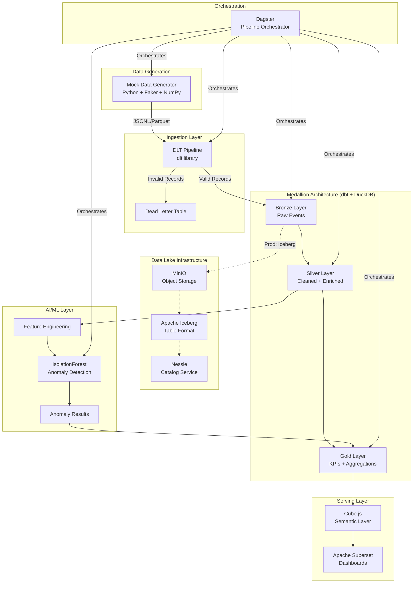

# AI-Powered Security Incident Analytics Platform

A production-style data engineering portfolio project demonstrating modern analytics architecture — from synthetic security log generation through medallion transformations, semantic layers, interactive dashboards, pipeline orchestration, and ML-powered anomaly detection.

## Architecture

The platform implements a complete data pipeline: mock security events are generated, ingested into a Bronze layer, progressively refined through Silver (cleaned/enriched) and Gold (aggregated KPIs) layers using dbt, scored by an IsolationForest anomaly detector, exposed via a Cube.js semantic layer, and visualized in Apache Superset dashboards — all orchestrated by Dagster.



## Technology Stack

| Layer | Technology | Version |
|-------|-----------|---------|
| Data Generation | Python + Faker + NumPy | 3.11+ / 22.0+ / 1.26+ |
| Ingestion | dlt (data load tool) | 0.4+ |
| Storage (MVP) | DuckDB + Parquet | 0.10+ |
| Storage (Prod) | MinIO + Apache Iceberg + Nessie | latest / 1.4+ / 0.77+ |
| Transformation | dbt Core + dbt-duckdb | 1.7+ / 1.7+ |
| Semantic Layer | Cube.js | 0.35+ |
| Visualization | Apache Superset | 3.1+ |
| Orchestration | Dagster | 1.6+ |
| ML/AI | scikit-learn (IsolationForest) | 1.4+ |
| Containerization | Docker Compose | v2+ |
| Observability | Python logging (JSON) | stdlib |

## Prerequisites

- **Python** 3.11+
- **Docker Engine** 24+ and **Docker Compose** v2+
- **16 GB RAM** minimum (8+ containers in full profile)
- **20 GB disk** space available
- **Git** for version control

## Quick Start

```bash
git clone <repository-url> && cd security-incident-analytics-platform
make setup
make generate-data
make run-pipeline
make docker-up
```

`make setup` creates a virtual environment and installs all dependencies. `make generate-data` produces a 10K-event synthetic dataset. `make run-pipeline` runs ingestion, transformation, and anomaly detection end-to-end. `make docker-up` starts Docker services (Superset, Dagster, Cube.js, MinIO, Nessie).

## Project Structure

```
├── mock_data/              # Synthetic security log generator
│   ├── generator.py        # Main generation orchestrator
│   ├── schemas.py          # Pydantic models (SecurityEvent, enums)
│   ├── distributions.py    # Statistical distributions for events
│   ├── anomaly_injector.py # Anomaly pattern injection
│   └── config.yaml         # Generator configuration
├── dlt_pipeline/           # DLT ingestion pipeline (Bronze layer)
│   ├── pipeline.py         # Pipeline execution
│   ├── sources.py          # dlt source/resource definitions
│   └── validators.py       # Record validation logic
├── dbt_project/            # dbt transformations (Silver + Gold)
│   ├── models/
│   │   ├── staging/        # Source definitions
│   │   ├── silver/         # Cleaned + enriched events
│   │   └── gold/           # KPI aggregations
│   └── macros/             # Reusable SQL macros
├── ml_detection/           # AI anomaly detection
│   ├── features.py         # Feature vector extraction
│   ├── train.py            # IsolationForest training
│   ├── predict.py          # Model inference + scoring
│   └── evaluate.py         # Model evaluation metrics
├── dagster_pipeline/       # Dagster orchestration
│   ├── assets.py           # Software-defined assets
│   ├── jobs.py             # Pipeline job definitions
│   └── schedules.py        # Cron-based schedules
├── cube/                   # Cube.js semantic layer schemas
├── docker/                 # Docker service configurations
├── dashboards/             # Superset dashboard JSON exports
├── scripts/                # Shared utilities (logging, retry, health checks)
├── tests/                  # Test suite
│   ├── unit/               # Unit + property-based tests
│   └── integration/        # Integration tests
├── data/                   # DuckDB database files (generated)
├── models/                 # ML model artifacts (generated)
├── logs/                   # Pipeline run logs (generated)
├── docs/                   # Extended documentation
├── Makefile                # Task runner (setup, test, pipeline targets)
├── pyproject.toml          # Python project config + dependencies
├── docker-compose.yml      # Full Docker service orchestration
└── .env.example            # Environment variable template
```

## Available Make Targets

| Target | Description |
|--------|-------------|
| `make setup` | Create virtual environment and install dependencies |
| `make generate-data` | Generate 10K synthetic security events |
| `make ingest` | Run DLT ingestion into Bronze layer |
| `make transform` | Run dbt build (Bronze → Silver → Gold) |
| `make detect-anomalies` | Train IsolationForest and score anomalies |
| `make run-pipeline` | Execute full pipeline end-to-end |
| `make test` | Run all tests (unit + property + integration) |
| `make lint` | Run ruff linter and formatter check |
| `make docs` | Generate and serve dbt documentation |
| `make docker-up` | Start all Docker services |
| `make docker-down` | Stop all Docker services |
| `make clean` | Remove generated artifacts |

## Documentation

Detailed documentation is available in the `docs/` directory:

- [Architecture](docs/architecture.md) — System design and component interactions
- [Data Lineage](docs/data_lineage.md) — Complete data flow from source to dashboard
- [Data Dictionary](docs/data_dictionary.md) — Table and column definitions
- [Setup Guide](docs/setup_guide.md) — Detailed installation instructions
- [Data Lake Architecture](docs/data_lake_architecture.md) — MinIO + Iceberg + Nessie
- [Troubleshooting](docs/troubleshooting.md) — Common issues and solutions

## License

This project is a portfolio demonstration of modern data engineering practices.
