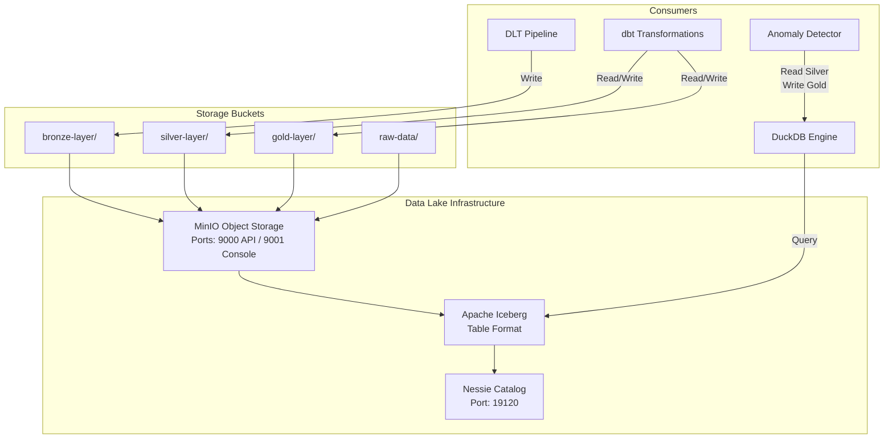
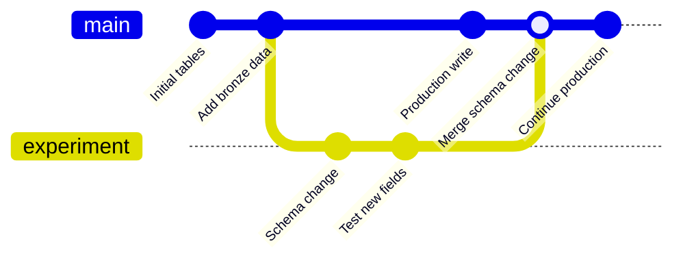

# Data Lake Architecture

## Overview

The Security Analytics Platform uses a modern data lakehouse architecture built on three core components:

- **MinIO** — S3-compatible object storage for data persistence
- **Apache Iceberg** — Open table format enabling schema evolution and time-travel queries
- **Nessie** — Git-like catalog providing versioning, branching, and transactional guarantees

This combination delivers enterprise-grade data lake capabilities while remaining fully open-source and containerized for local development.

## Architecture Diagram



## Component Details

### MinIO — Object Storage

MinIO provides S3-compatible object storage as the persistence layer for all data lake files.

| Property | Value |
|----------|-------|
| Image | `minio/minio:latest` |
| API Port | 9000 |
| Console Port | 9001 |
| Default Credentials | `minioadmin` / `minioadmin123` |
| Data Volume | `minio_data:/data` |

**Bucket Organization (Medallion Architecture):**

| Bucket | Purpose | Contents |
|--------|---------|----------|
| `raw-data` | Landing zone for source files | JSONL/Parquet from Mock Generator |
| `bronze-layer` | Raw ingested events | Iceberg tables with metadata |
| `silver-layer` | Cleaned and enriched events | Deduplicated, validated, enriched |
| `gold-layer` | Aggregated KPIs and results | KPI summaries, anomaly results |

### Apache Iceberg — Table Format

Apache Iceberg provides the table format layer that sits between the compute engines and the object storage. It enables:

- **Schema evolution** without data rewrites
- **Hidden partitioning** for optimized query plans
- **Time-travel queries** via snapshot isolation
- **ACID transactions** for reliable concurrent writes
- **Column-level statistics** for predicate pushdown

**Registered Tables:**

| Namespace | Table | Location |
|-----------|-------|----------|
| `bronze` | `raw_security_events` | `s3://bronze-layer/raw_security_events` |
| `bronze` | `dead_letter_events` | `s3://bronze-layer/dead_letter_events` |
| `silver` | `silver_events` | `s3://silver-layer/silver_events` |
| `gold` | `kpi_summary` | `s3://gold-layer/kpi_summary` |
| `gold` | `attack_volume_by_day` | `s3://gold-layer/attack_volume_by_day` |
| `gold` | `attack_volume_by_country` | `s3://gold-layer/attack_volume_by_country` |
| `gold` | `hourly_event_summary` | `s3://gold-layer/hourly_event_summary` |
| `gold` | `anomaly_results` | `s3://gold-layer/anomaly_results` |

### Nessie — Catalog Service

Nessie provides Git-like version control for the Iceberg catalog, enabling branching, tagging, and transactional multi-table commits.

| Property | Value |
|----------|-------|
| Image | `projectnessie/nessie:latest` |
| Port | 19120 |
| API Version | v2 |
| Store Type (Dev) | `IN_MEMORY` |
| Store Type (Prod) | `RocksDB` |

## Schema Evolution Workflow

Iceberg supports schema evolution without requiring a full data rewrite. This is critical for a security analytics platform where new fields (e.g., new threat indicators) may need to be added over time.

### Supported Operations

| Operation | Impact on Existing Data | Example |
|-----------|------------------------|---------|
| Add column | None — new column defaults to NULL | Add `threat_intel_score` |
| Drop column | None — column hidden from new reads | Remove deprecated field |
| Rename column | None — tracked by field ID | Rename `src_ip` → `source_ip` |
| Reorder columns | None — cosmetic change | Move `severity` earlier |
| Widen type | None — compatible promotion | `int` → `long` |

### Evolution Process

```
1. Update Iceberg schema via PyIceberg:
   table.update_schema()
       .add_column("new_field", StringType())
       .commit()

2. Existing data files remain unchanged (no rewrite).

3. New writes include the new column.

4. Reads of old data return NULL for the new column.

5. Nessie records the schema change as a catalog commit.
```

### Example: Adding a New Column

```python
from pyiceberg.catalog import load_catalog

catalog = load_catalog("nessie", uri="http://localhost:19120/api/v1", ...)
table = catalog.load_table("silver.silver_events")

# Add a new column without rewriting data
with table.update_schema() as update:
    update.add_column("threat_intel_score", FloatType(), doc="External threat score")

# All existing data now shows NULL for this column
# New data can include the field
```

## Nessie Branching and Versioning

Nessie provides Git-like semantics for the data catalog, enabling safe experimentation and rollback.

### Core Concepts

| Concept | Description | Equivalent in Git |
|---------|-------------|-------------------|
| Branch | Mutable pointer to a catalog state | `git branch` |
| Tag | Immutable snapshot of catalog state | `git tag` |
| Commit | Atomic change to one or more tables | `git commit` |
| Merge | Combine branch changes into main | `git merge` |

### Branching Workflow



### Common Operations

```bash
# List branches
curl http://localhost:19120/api/v2/trees

# Create a branch for experimentation
curl -X POST http://localhost:19120/api/v2/trees \
  -H "Content-Type: application/json" \
  -d '{"name": "experiment-new-schema", "type": "BRANCH"}'

# Tag a known-good state before migration
curl -X POST http://localhost:19120/api/v2/trees \
  -H "Content-Type: application/json" \
  -d '{"name": "pre-migration-v1", "type": "TAG"}'
```

### Use Cases

1. **Safe Schema Migration** — Create a branch, apply schema changes, validate queries, then merge back to main.

2. **Pipeline Testing** — Run experimental pipelines against a branch without affecting production data.

3. **Rollback** — If a pipeline writes bad data, reset to a previous commit or tag.

4. **Audit Trail** — Every catalog change is tracked with timestamps and metadata.

## MVP vs Production Profile

| Aspect | MVP Profile | Production Profile |
|--------|------------|-------------------|
| Storage | Local DuckDB + Parquet files | MinIO object storage |
| Table Format | DuckDB native tables | Apache Iceberg |
| Catalog | None (DuckDB internal) | Nessie |
| Schema Evolution | Manual (recreate table) | Native Iceberg support |
| Versioning | Git (file-level) | Nessie (table-level) |
| Resource Usage | ~2GB RAM | ~4GB+ RAM |
| Docker Services | None required | MinIO + Nessie containers |

### Switching Profiles

Set the environment variable to activate the production profile:

```bash
# MVP (default) - uses local DuckDB
export PIPELINE_PROFILE=mvp

# Production - uses MinIO + Iceberg + Nessie
export PIPELINE_PROFILE=production
```

## Deployment

### Full Platform

```bash
# Validate prerequisites
./scripts/setup.sh

# Start all services
docker compose up -d

# Verify services
curl -f http://localhost:9000/minio/health/live    # MinIO
curl -f http://localhost:19120/api/v2/config       # Nessie

# Create Iceberg tables
python scripts/create_iceberg_tables.py
```

### Lite Profile (Development)

```bash
# Start only MinIO and Nessie (under 4GB RAM)
docker compose -f docker-compose.lite.yml up -d
```

### Minimum System Requirements

| Resource | Minimum | Recommended |
|----------|---------|-------------|
| RAM | 16 GB | 32 GB |
| Disk Space | 20 GB | 50 GB |
| Docker Engine | 24+ | Latest |
| Docker Compose | v2+ | Latest |
| CPU Cores | 4 | 8 |

## Data Flow

```
Mock Generator → JSONL/Parquet files
       ↓
DLT Pipeline → Bronze (MinIO/Iceberg or DuckDB)
       ↓
dbt Silver → Cleaned + Enriched (MinIO/Iceberg or DuckDB)
       ↓
dbt Gold → KPIs + Aggregations (MinIO/Iceberg or DuckDB)
       ↓
ML Detection → Anomaly Results (Gold layer)
       ↓
Cube.js → REST/GraphQL API
       ↓
Superset → Interactive Dashboards
```

## Troubleshooting

| Issue | Cause | Resolution |
|-------|-------|------------|
| MinIO health check fails | Service not started | Check `docker compose logs minio` |
| Nessie API returns 404 | Wrong API version | Use `/api/v2/config` endpoint |
| Bucket creation fails | MinIO not healthy yet | Increase sleep in init script |
| Iceberg table creation fails | Nessie not reachable | Verify Nessie is running on port 19120 |
| Out of memory | Too many services | Use lite profile for development |
| Permission denied on buckets | Credentials mismatch | Check MINIO_ROOT_USER/PASSWORD env vars |
